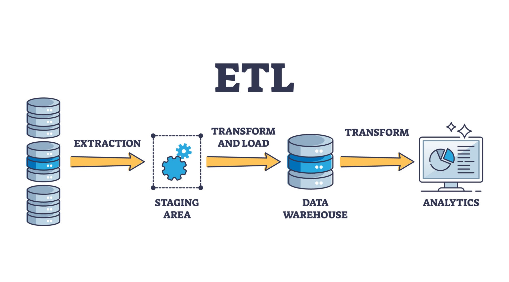

# Real Estate ETL Project



A small ETL pipeline and scraper for real-estate listings, with a minimal demo app and Docker support.

**Repository:** `book_store_scraping_project_etl` (owner: `sefabckn`)

## Project Overview

This repository contains a lightweight pipeline that scrapes real-estate data, transforms and stores it locally, and exposes a simple app for exploration. It is intended as a small end-to-end example for collecting, processing and visualizing property listing data.

## Features

- Scraper: collects listing data from configured sources (`src/scraper.py`).
- ETL: extracts, transforms and loads data into the `data/` folder (`src/etl.py`).
- Demo app: sample app entrypoint is `app.py` (streamlit or Flask depending on implementation).
- Docker: `Dockerfile` and `docker-compose.yml` for containerized runs.

## Repository Structure

- `app.py` — demo app to explore processed data.
- `docker-compose.yml` — compose config for containerized services.
- `Dockerfile` — image build instructions.
- `requirements.txt` — Python dependencies.
- `data/` — data output (CSV/Parquet/other) produced by ETL.
- `src/` — source package
	- `__init__.py`
	- `etl.py` — main ETL pipeline (run with `python -m src.etl`).
	- `scraper.py` — web scraper for listings.
	- `test.ipynb` — exploratory notebook.

## Prerequisites

- Python 3.8+ (adjust based on `requirements.txt`)
- `pip` and optionally Docker & Docker Compose if using containers

## Quick Start (local)

1. Create and activate a virtual environment:

```bash
python -m venv .venv
source .venv/Scripts/activate   # On Windows (bash.exe): .venv/Scripts/activate
pip install --upgrade pip
```

2. Install dependencies:

```bash
pip install -r requirements.txt
```

3. Run the ETL pipeline to collect and process data:

```bash
python -m src.etl
```

4. Run the scraper directly (optional):

```bash
python -m src.scraper
```

5. Start the demo app:

```bash
python app.py
# or if it's a streamlit app:
streamlit run app.py
```

## Quick Start (Docker)

Build and run with Docker Compose:

```bash
docker-compose up --build
```

This creates a reproducible environment for running the ETL and the demo app.

## Data

Processed outputs are stored under `data/`. You can inspect CSV/Parquet files generated by the ETL. Remove or archive old files as needed.

## Development notes

- To iterate on the scraper, update `src/scraper.py` and re-run the ETL pipeline.
- Keep secrets/configuration out of this repo; use environment variables or a local `config` file ignored by Git.

## Contributing

Contributions are welcome. Please open issues for bugs or feature requests and submit pull requests with tests or brief descriptions of changes.

## License

This project does not include a license file. Add a `LICENSE` file to clarify reuse permissions.

## Contact

Owner: `sefabckn` — open an issue or PR on the repository for questions.

---

If you'd like, I can also:

- add a `LICENSE` file
- extract a minimal `Makefile` or `scripts/` helpers for common commands
- add usage examples showing expected `data/` output sample

Let me know which additions you prefer.
